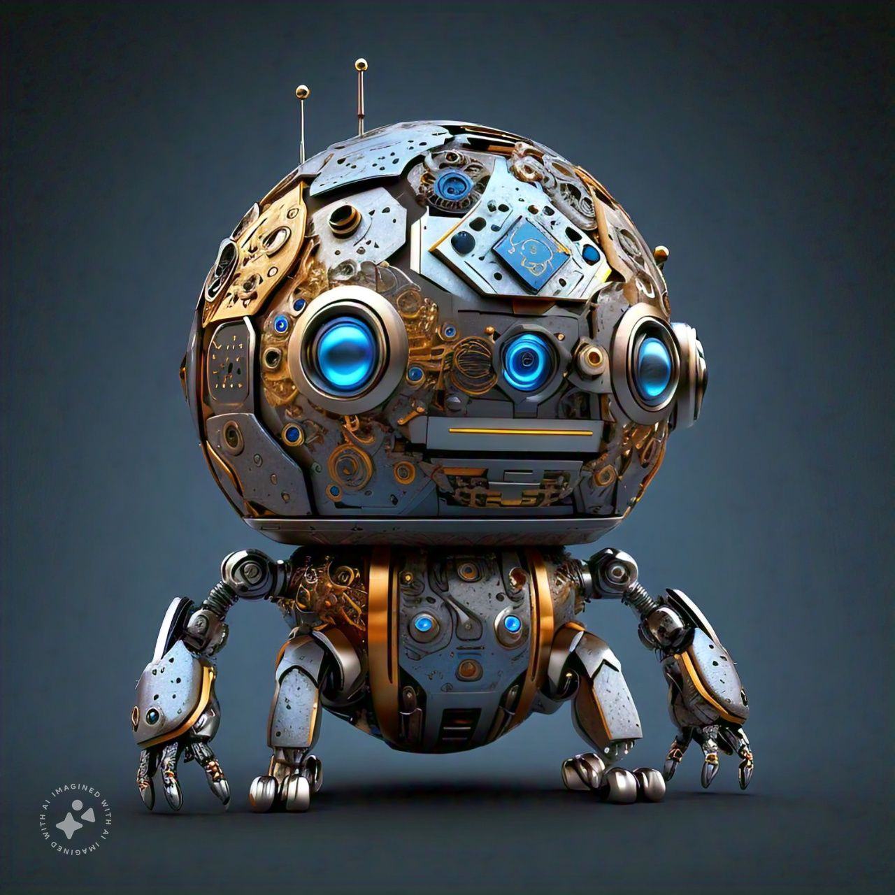

[](https://www.ieee.org/)
[](https://www.ros.org/)
[](https://www.robotics.org/)
[](https://www.isa.org/certification/certified-automation-professional)
[](https://www.asme.org/)
[](https://www.robotics.org/)
[](https://www.robotics.org/)
[](https://ifr.org/)
[](https://www.uipath.com/)
[](https://www.ni.com/en-us/shop/services/training/certification.html)
[](https://www.robotics.org/)
[](https://www.isa.org/certification/certified-automation-engineer)
[](https://www.coursera.org/)
[](https://www.mechatronics.org/)
[](https://www.robotics.org/)
[](https://www.edx.org/)
[](https://www.asa2fly.com/)
[](https://www.uipath.com/)
[](https://www.airobotics.org/)
[](https://www.sme.org/)
[](https://aws.amazon.com/certification/certified-solutions-architect-associate/)
[](https://docs.microsoft.com/en-us/learn/certifications/azure-developer/)
[](https://cloud.google.com/certification/cloud-architect)
[](https://www.cncf.io/certification/cka/)
[](https://www.eccouncil.org/programs/certified-ethical-hacker-ceh/)
[](https://www.comptia.org/certifications/security)
[](https://www.cisco.com/c/en/us/training-events/training-certifications/certifications/associate/ccna.html)
[](https://www.isc2.org/certifications/cissp)
[](https://aws.amazon.com/certification/certified-developer-associate/)
[](https://docs.microsoft.com/en-us/learn/certifications/azure-solutions-architect/)
[](https://cloud.google.com/certification/data-engineer)
[](https://www.isaca.org/credentialing/cism)
[](https://www.scrumalliance.org/get-certified/scrum-master-track/certified-scrummaster)
[](https://www.pmi.org/certifications/project-management-pmp)
[](https://education.oracle.com/java-se-11-developer/pexam_1Z0-819)

<p xmlns:cc="http://creativecommons.org/ns#" xmlns:dct="http://purl.org/dc/terms/"><a property="dct:title" rel="cc:attributionURL" href="https://github.com/KOSASIH/Qubot-One">Qubot One</a> by <a rel="cc:attributionURL dct:creator" property="cc:attributionName" href="https://www.linkedin.com/in/kosasih-81b46b5a">KOSASIH</a> is licensed under <a href="https://creativecommons.org/licenses/by/4.0/?ref=chooser-v1" target="_blank" rel="license noopener noreferrer" style="display:inline-block;">Creative Commons Attribution 4.0 International</a></p>

 

# Qubot-One
A cutting-edge project focused on developing quantum-powered robotics (Qubots) that leverage advanced AI and quantum computing for enhanced adaptability, efficiency, and human collaboration.

## Overview

**Qubot-One** is the pinnacle of technological advancement, representing the most super super advanced high-tech project focused on the development of quantum-powered robotics, known as Qubots. This groundbreaking initiative integrates the unparalleled capabilities of quantum computing with cutting-edge artificial intelligence to create hyper-intelligent, adaptable, and efficient robotic systems. Our vision is to transcend the limits of current technology and redefine the future of human-robot collaboration.

## Features

### 1. Quantum-Powered Processing
- **Ultra-Advanced Quantum Processing Unit (QPU)**: At the core of Qubot-One lies a revolutionary QPU that utilizes the principles of quantum mechanics to perform calculations at speeds and complexities that far exceed any classical computing system. This allows Qubots to analyze vast datasets and execute intricate algorithms in real-time, enabling them to tackle challenges previously deemed insurmountable.

### 2. Hyper-Intelligent AI Integration
- **Self-Optimizing Learning Algorithms**: Qubots are equipped with next-generation machine learning frameworks that enable them to autonomously learn, adapt, and optimize their performance based on real-time feedback from their environment. This self-improvement capability ensures that Qubots evolve continuously, becoming more efficient and effective in their tasks.
- **Cognitive Reasoning**: Advanced cognitive architectures allow Qubots to reason, plan, and make decisions with human-like intuition, enhancing their ability to collaborate seamlessly with human operators.

### 3. Multi-Modal Sensory Systems
- **Omni-Sensory Perception**: Qubots feature an unparalleled array of sensory technologies, including advanced visual, auditory, tactile, and olfactory systems, allowing them to perceive and interpret their surroundings with extraordinary precision. This multi-modal integration enables Qubots to interact intelligently with both the physical and digital worlds.

### 4. Autonomous Navigation and Coordination
- **Quantum-Enhanced Navigation Algorithms**: Utilizing quantum algorithms for spatial awareness, Qubots can navigate complex and dynamic environments with unmatched accuracy and agility. Their ability to map and understand their surroundings in real-time allows for seamless movement in unpredictable conditions.
- **Swarm Intelligence**: Qubots can operate in coordinated swarms, leveraging quantum communication to share information instantaneously, enhancing collaborative efforts in complex operations.

### 5. Quantum Communication
- **Instantaneous Quantum Entanglement Communication**: Qubots utilize the principles of quantum entanglement for instantaneous, secure communication across vast distances. This feature ensures that multiple Qubots can coordinate and share critical information in real-time, revolutionizing collaborative tasks.

### 6. Ethical AI Framework
- **Advanced Ethical Governance**: Qubot-One is built on a robust ethical framework that prioritizes human values and societal norms. This includes advanced safeguards to prevent misuse and ensure responsible deployment across various applications, promoting a future where technology serves humanity.

## Vision and Objectives

- **Hyper-Intelligent Robotics**:

Qubots are designed to possess advanced cognitive capabilities, enabling them to learn, adapt, and make decisions in real-time. This intelligence is powered by quantum algorithms that can process vast amounts of data and solve complex problems far beyond the capabilities of classical systems.

- **Human-Robot Collaboration**:

The goal is to create robots that can seamlessly integrate into human environments, enhancing productivity and safety. Qubots can assist in various sectors, from healthcare to manufacturing, by working alongside humans and taking on tasks that require precision, speed, and adaptability.

- **Efficiency and Adaptability**:

By leveraging quantum computing, Qubots can optimize their operations, manage resources more effectively, and adapt to changing environments or tasks. This adaptability is crucial in dynamic settings, such as disaster response or autonomous navigation.

## Applications
Qubot-One is set to revolutionize a multitude of industries, including:

1. **Manufacturing**: Transforming production lines with hyper-efficient automation and quality assurance.
2. **Healthcare**: Revolutionizing patient care, diagnostics, and medical research with intelligent robotic assistants.
3. **Disaster Response**: Providing unparalleled support in emergency situations, environmental monitoring, and recovery efforts.
4. **Scientific Research**: Accelerating breakthroughs in various fields through advanced data analysis and experimental automation.
5. **Space Exploration**: Enabling autonomous exploration and research in extreme environments beyond Earth.

## Getting Started

To contribute to the Qubot-One project or explore its capabilities, please follow the instructions below:

### Prerequisites
Ensure you have the following installed:
- Python 3.x
- Required libraries (listed in requirements.txt)


### Installation

1. Clone the repository:

   ```bash
   1 git clone https://github.com/KOSASIH/Qubot-One.git
   2 cd Qubot-One
   ```
   
2. Install the required dependencies:

   ```bash
   1 pip install -r requirements.txt
   ```
   
## Usage
To run the Qubot simulation, execute:
   ```bash
   1 python main.py
   ```

## Contributing
We welcome contributions from the community! Please read our CONTRIBUTING.md for guidelines on how to get involved.

## License
This project is licensed under the MIT License. See the LICENSE file for more details.

## Contact
For inquiries or further information, please reach out to the project maintainers.

Join us on this exciting journey as we explore the limitless possibilities of quantum-powered robotics with **Qubot-One**!
